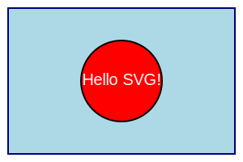

# Learning Objective

At the end of this challenge, the scholar will be able to use/perform/do  ...... 


## Challenge


## Basic Usage of the Challenge-Based-Learning Sheets for STEMgraph
 

### Description

Challenges are a great way to learn new skills. 
If they are selfexplanatory and atomic, they can be used by scholars in a wide range of contexts, and repeated over and over again.
In comparision to learning materials (like books or longer tutorials), these challenges are meant to be used by teachers, to arrange new paths through a graph of skills.




\textbf{Note: }Sometimes there needs to be a little bit of a warning or a hint for the scholar, before starting the challenge. 
This should go here!


### Task

Generating a new challenge is not that hard! 
Try to think of something that you would like to learn. 
If you can teach it to someone in less than 30 minutes by explaining it, it looks like a great challenge to me.
Often times, these challenges will only teach a single command or skill, or a few variations of it.
The goal here is to not overload the scholar with too many new concepts. 
In order to become good at STEM, it is important to learn a single skill at a time and repeat it until the foundations are really solid!
It also isn't a problem, if the task explained in too small steps. 
Of course, it shouldn't be boring by being repetetive, but it should be slow and detailed.
Always make sure, to expect the minmal amount of prerequisites from the scholar. 
Only this way the STEMgraph can ensure, that challenges are mix-and-match-able.

- Write down a skill, on a piece of paper that you really like.
- Come up with a good explaination, why this skill is useful in STEM. 
- Explain, why this is a basic task to perform.
- Think of 3 to 4 applications of this skill.
- Answer the questions below.
- Write a request to ChatGPT using the following prompt:
```

I am working on github.com/STEMgraph challenges.
Today I worked on the following:
```
<insert raw text of this challenge here>
```
Please give me detailed feedback to my answers to the provided questions.
Here are my answers in the correct order:
```
<insert your answers to the tasks questions here>
```

```


### Questions

- What is the skill you want to teach your scholars?
- Why do you think its a foundationary skill?
- What are the applications of this skill?
- What prerequisites do you need to perform this skill?
- What is the first step to perform this skill?
- What advice do you have for the scholar at the end of this challenge?


### Advice

Let someone from your peer-group try out your challenges!
Have them generate issues in the github repository and let them write down how long it took them to complete the challenge.
A good challenge is one, that takes less than 30 minutes to complete.
This way, scholars can plan their day.
Happy generating!


